## AT24CXX容量

​	AT24C01，AT24C02，AT24C04，AT24C08，AT24C16，AT24C32，AT24C64，AT24C128，AT24C256…不同的xxx代表不同的容量。

|   型号    | bit容量  |  Byte容量  |
| :-------: | :------: | :--------: |
|  AT24C01  |  1Kbit   |  128Byte   |
|  AT24C02  |  2Kbit   |  256Byte   |
|  AT24C04  |  4Kbit   |  512Byte   |
|  AT24C08  |  8Kbit   |  1024Byte  |
|  AT24C16  |  16Kbit  |  2048Byte  |
|  AT24C32  |  32Kbit  |  4096Byte  |
|  AT24C64  |  64Kbit  |  8192Byte  |
| AT24C128  | 128Kbit  | 16384Byte  |
| AT24C256  | 256Kbit  | 32768Byte  |
| AT24C512  | 512Kbit  | 65536Byte  |
| AT24C1024 | 1024Kbit | 131072Byte |

## AT24CXX页与页内单元
​	总容量(Byte容量) = 页数 × 页内字节单元数。

|   AT24CXXX    |	Byte容量  |  页数  |  页内字节单元数  |
| :-------: | :------: | :--------: |:--------: |
|AT24C01	|128Byte	|16页	|8Byte|
|AT24C02	|256Byte	|32页	|8Byte|
|AT24C04	|512Byte	|32页	|16Byte|
|AT24C08	|1024Byte	|64页	|16Byte|
|AT24C16	|2048Byte	|128页	|16Byte|
|AT24C32	|4096Byte	|128页	|32Byte|
|AT24C64	|8192Byte	|256页	|32Byte|
|AT24C128	|16384Byte	|256页	|64Byte|
|AT24C256	|32768Byte	|512页	|64Byte|
| AT24C512  |65536Byte	|512页	|128Byte|
|AT24C1024	|131072Byte	|512页	|256Byte|

## AT24CXX寻址方式

> 不是IIC地址，是存储器内部寻址

​	对AT24CXXX进行读写操作时，都得先访问存储地址、比如AT24C01写一个字节的IIC时序：

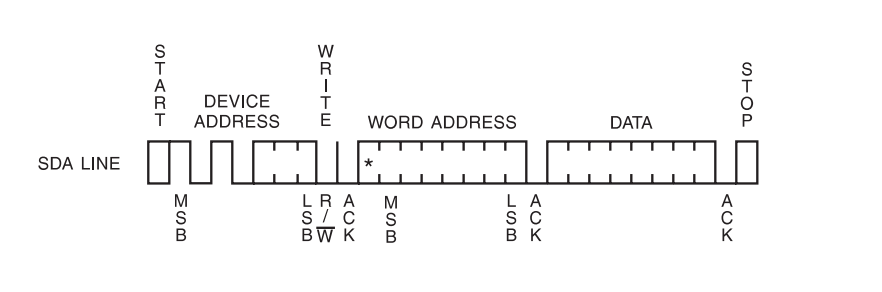

​	先发送设备地址，收到应答后再发送需要写数据的地址(**WORD ADDRESS**)。AT24C01容量为128Byte则**WORD ADDRESS**只需要7bit就可以覆盖128Byte的数据地址。通俗的讲就是128Byte就占用了128个地址，一个7bit的数据范围为(0-127)刚好128，所以128Byte的字节地址需要一个7bit的数据来表示。
AT24CXXX 字节地址如下(*表示无效位):

|AT24CXXX	|页数	|页内字节单元数	|容量(Byte)	|WORD ADDRESS(占用bit数)	|WORD ADDRESS|
| :-------: | :------: | :--------: |:--------: |:--------: |:--------: |
|AT24C01|	16页	|	8Byte	|	128Byte	|7bit	| 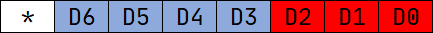 |
|AT24C02|	32页	|	8Byte	|	256Byte	|8bit	| 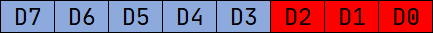 |
|AT24C04	|32页	|16Byte	|512Byte	|9bit	| 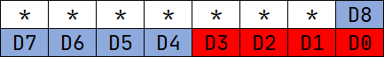 |
|AT24C08	|64页	|16Byte	|1024Byte	|10bit	| 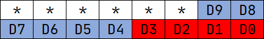 |
|AT24C16	|128页	|16Byte	|2048Byte	|11bit	|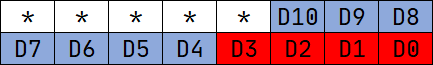|
|AT24C32	|128页	|32Byte	|4096Byte	|12bit	|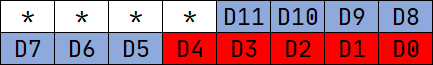|
|AT24C64	|256页	|32Byte	|8192Byte	|13bit	|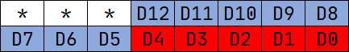|
|AT24C128	|256页	|64Byte	|16384Byte	|14bit	|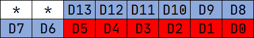|
|AT24C256	|512页	|64Byte	|32768Byte	|15bit	|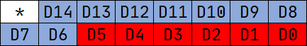|
|AT24C512	|512页	|128Byte	|65536Byte	|16bit	|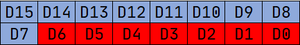|
|AT24C1024	|512页	|256Byte	|131072Byte	|17bit	|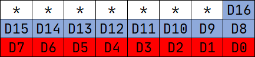|

## AT24CXX页地址与页内单元地址

​	比如AT24C256有512页每页64个字节，15bit的地址数据对其寻址，低6bit(D5-D0)为页内字节单元地址，高9bit(D14-D6)为页地址。

​	如第16页开始写，则**WORD ADDRESS** = 0x0400（000 0100 0000 0000)
​	**0**：地址无效位
​	**000 0100 00**：9位页地址
​	**00 0000**：6位页内字节单元地址

页地址与页内偏移地址的关系如下图。

|AT24CXXX	|页数	|页内字节单元数	|容量(Byte)	|WORD ADDRESS(占用bit数)	|页地址\|页内偏移地址|
| :-------: | :------: | :--------: |:--------: |:--------: |:--------: |
|AT24C01|	16页	|	8Byte	|	128Byte	|7bit	|  |
|AT24C02|	32页	|	8Byte	|	256Byte	|8bit	|  |
|AT24C04	|32页	|16Byte	|512Byte	|9bit	|  |
|AT24C08	|64页	|16Byte	|1024Byte	|10bit	|  |
|AT24C16	|128页	|16Byte	|2048Byte	|11bit	||
|AT24C32	|128页	|32Byte	|4096Byte	|12bit	||
|AT24C64	|256页	|32Byte	|8192Byte	|13bit	||
|AT24C128	|256页	|64Byte	|16384Byte	|14bit	||
|AT24C256	|512页	|64Byte	|32768Byte	|15bit	||
|AT24C512	|512页	|128Byte	|65536Byte	|16bit	||
|AT24C1024	|512页	|256Byte	|131072Byte	|17bit	||

比如：

​	**AT24C01**：

​	16页：需要4bit寻址(2^4=16)。

​	8Byte：需要3bit寻址(2^3=8)。

查看手册

​	**AT24C01**字节寻址需一个7bit地址：

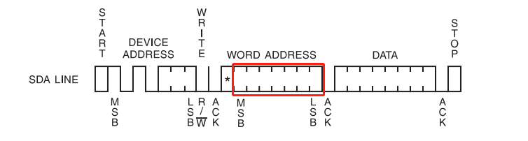

​	**AT24C128**字节寻址需一个14bit地址：

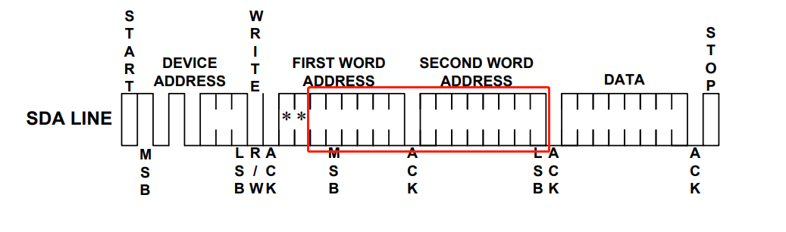

​	**AT24C256**字节寻址需一个15bit地址：

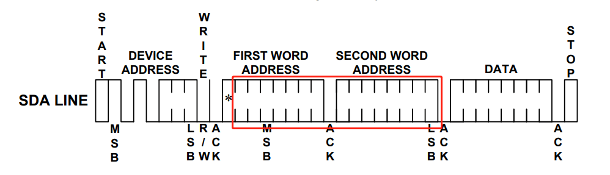

​	以此类推，其实就是上面总结的那张表。

## AT24CXX IIC地址

​	IIC通信需要先向从设备发送设备地址，AT24CXX芯片上有A2、A1、A0引脚，通过这三个引脚我们就可以自定义AT24CXX芯片的通信地址。

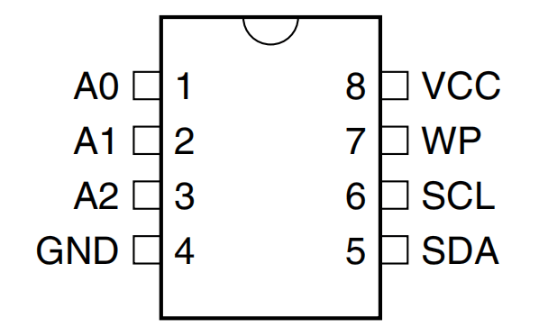

​	地址构成如下(手册上都会有写)，比如A2、A1、A0接地，则IIC写地址为1010 0000（0xA0），读地址为1010 0001（0xA1）。当然，地址详情还是需要根据**Datasheet**来进行判断。

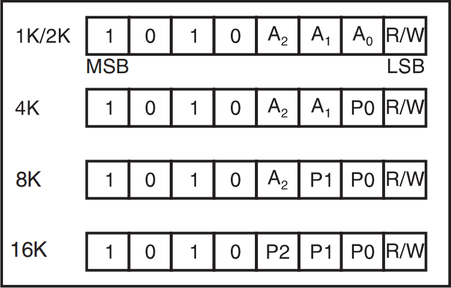

## AT24CXX 数据的读写

### 按字节写

### 按页写

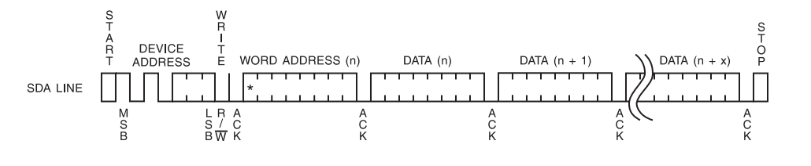

​	示例：
​	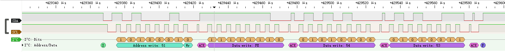

​	内容为：给**AT24C04**的最后的两个字节里面写入**0x54**和**0x53**。

------

​	注意：
  往AT24CXXX中写数据时，每写一个Byte的数据页内地址+1，当前页写满后会重新覆盖掉这一页前面的数据，而不会自动跳转到下一页，但是读会自动翻页。

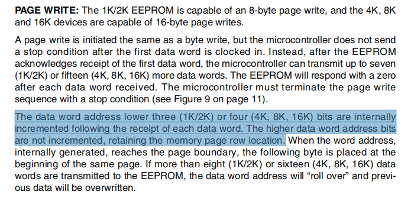

### 翻页写

​	翻页写其实就是执行一次下面的时序，也就是发送一次从机设备和字节地址最大就可以写入64字节的数据，如果要连写多页，就重新按照以下时序发送从机地址和字节地址。

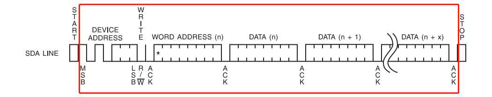

​	即写满一页之后，还是需要手动翻页的，但是不需要重发**Start**和**Stop**了；

### 按字节读

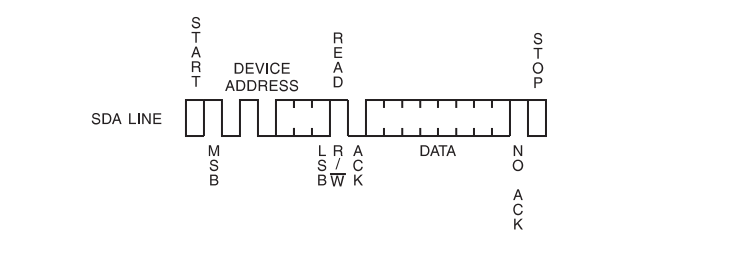

### 顺序读

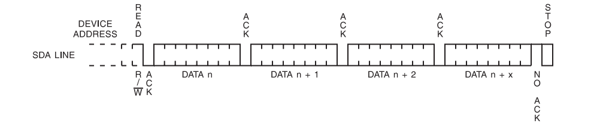

### 随机读

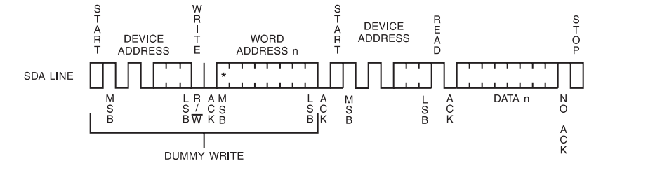

​	示例：

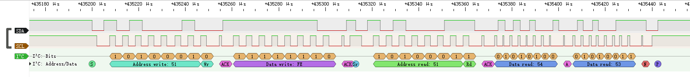

内容为：读取**AT24C04**的最后的两个字节，内容为**0x54**和**0x53**。
