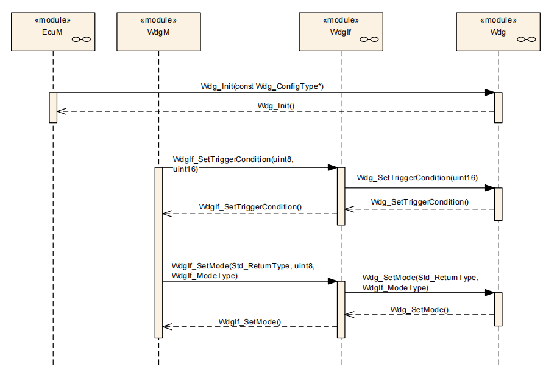
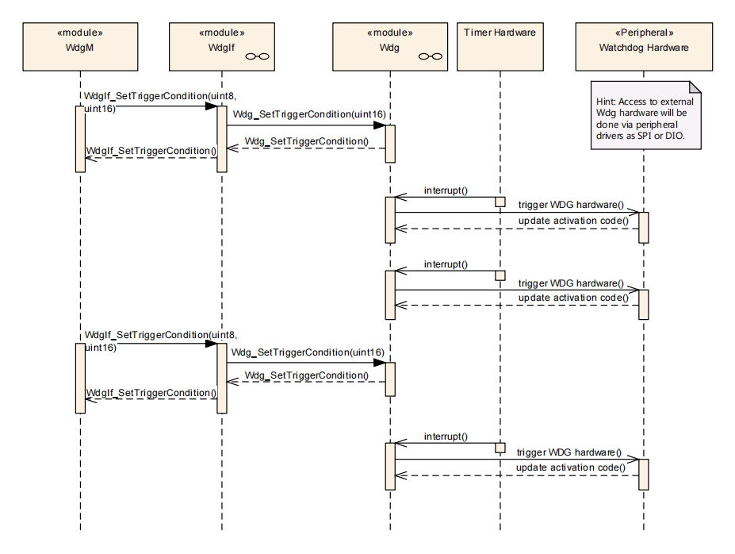

> 本文章所参考的 AUTOSAR 标准为 4.4.0 版本

# 简介

该模块具备初始化硬件看门狗、调整操作模式以及设定触发喂狗机制等功能。看门狗可根据其位置分为内部与外部两种类型，其中，内置于芯片内的称为内部看门狗，而外置的则称为外部看门狗。

无论是内部还是外部看门狗，`Watchdog Driver` 所使用的 `API` 都应保持统一。内部看门狗驱动属于 `MCAL` 层，而外部看门狗则属于 `ECU` 硬件抽象层。对于外部看门狗，其驱动需依赖 MCAL 中的其他驱动，如 `GPIO`、`IIC` 或 `SPI` 等，以执行喂狗操作。

# 内部看门狗

内部看门狗作为芯片内置的硬件监控机制，其驱动通常由芯片厂商提供。在使用前，务必确认其复位动作类型，避免冷复位或复位不完全等情形，以确保其能有效实现安全监控。然而，由于内部看门狗与芯片硬件紧密相关，若芯片本身存在硬件故障，可能会导致内部看门狗失效，从而陷入自保困境。因此，在关键安全系统中，单纯依赖内部看门狗可能不足以确保功能安全，此时需结合外部看门狗来共同保障系统的稳定运行。

# 外部看门狗

外部看门狗独立于受保护的芯片，可以是专门的硬件看门狗设备，通常达到 QM 等级。另一种类型是集成在 `PMIC` 内部的看门狗，这类设备通常能满足 `ASIL B` 或 `ASIL D` 功能安全等级的要求。在关键安全系统中，外部看门狗通常是必不可少的，它对于保障系统稳定性至关重要。相比之下，内部看门狗虽然有其作用，但在确保系统安全方面，外部看门狗显得更为重要。

# 看门狗控制模式

在 `AUTOSAR` 架构中，`Watchdog` 针对看门狗控制模式定义了以下三种模式：

- `Off Mode(WDGIF_OFF_MODE)`：代表看门狗关闭状态。对于关键安全系统，此模式通常不可用，即看门狗一旦被激活，就不能被关闭。
- `Slow Mode(WDGIF_SLOW_MODE)`：适用于系统启动初始化过程，提供较长的喂狗窗口时间。
- `Fast Mode(WDGIF_FAST_MODE)`：是系统正常运行时的标准喂狗模式，具有较短的喂狗窗口时间。

# 看门狗喂狗时序

在 `Watchdog` 的操作过程中，存在三个关键的函数调用场景，分别对应于 `Watchdog` 的初始化、触发喂狗动作以及模式变更。

- `Watchdog` 初始化：此过程通过 `EcuM（Electronic Control Unit Manager）`模块发起，调用 `Wdg_Init` 函数来完成 `Watchdog` 的初始化配置。这一步骤确保了看门狗在启动时就处于正确的配置状态，为后续操作提供了基础。
- 触发看门狗喂狗：当系统需要在特定条件下喂狗时，通过 `WdgM（Watchdog Manager）`模块调用 `WdgIf（Watchdog Interface）`模块提供的 `WdgIf_SetTriggerCondition` 函数。这一函数的作用是设置触发条件，当这些条件满足时，将触发底层驱动执行喂狗动作，确保看门狗不会因超时而触发复位。
- 改变看门狗模式：随着系统运行状态的变化，可能需要对看门狗的模式进行调整。这同样通过 `WdgM` 模块实现，调用 `WdgIf` 模块提供的 `WdgIf_SetMode` 函数来完成模式变更。通过此函数，系统可以在 `Slow Mode`（慢模式）和 `Fast Mode`（快模式）之间切换，以适应不同的运行场景。

这些函数调用场景共同构成了看门狗喂狗的时序逻辑，确保了看门狗在系统中的有效性和安全性。

如下图所示，展示了 `Wathdog` 抽象层（`WdgIf`）与底层看门狗硬件之间的交互时序。从图中可以看出，当 `WdgIf` 模块需要触发喂狗动作时，它会调用`WdgIf_SetTriggerCondition`函数。这个函数是 `WdgIf` 模块提供的接口，用于设置触发喂狗的条件。

在`WdgIf_SetTriggerCondition`函数内部，它会继续调用底层 `Wdg` 驱动中的 `Wdg_SetTriggerCondition` 函数。这个底层函数直接与硬件交互，负责实现具体的喂狗动作。通过调用 `Wdg_SetTriggerCondition`函数，看门狗硬件会根据设定的条件执行喂狗操作，从而防止因超时而导致的系统复位。

这种交互时序确保了看门狗机制的有效性和可靠性。通过 `WdgIf` 模块与底层 `Wdg` 驱动的协同工作，系统能够在需要时及时触发喂狗动作，保持看门狗的运行状态，从而防止因系统故障而导致的意外复位。这对于关键安全系统来说尤为重要，能够确保系统的稳定性和安全性。

# API 列表

| 函数名                      | 函数功能                                                                                         |
| --------------------------- | ------------------------------------------------------------------------------------------------ |
| **Wdg_Init**                | 初始化看门狗                                                                                     |
| **Wdg_SetMode**             | 设置看门狗模式，模式可分为： - `WDGIF_OFF_MODE` - `WDGIF_SLOW_MODE` - `WDGIF_FAST_MODE` |
| **Wdg_SetTriggerCondition** | 设置看门狗触发计数器的超时值                                                                     |
| **Wdg_GetVersionInfo**      | 返回 `Wdg` 模块的版本信息                                                                          |

# 软件实现

待更新

# 参考

- https://www.zhihu.com/tardis/zm/art/651467544?source_id=1005
