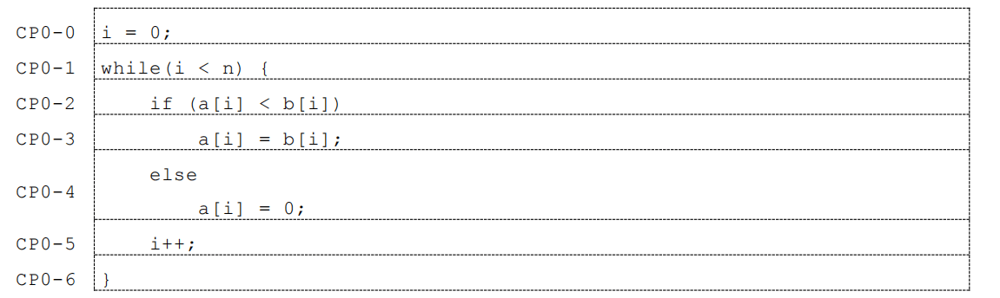
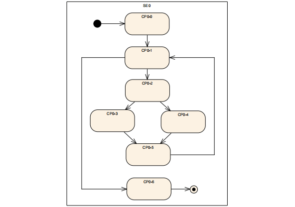
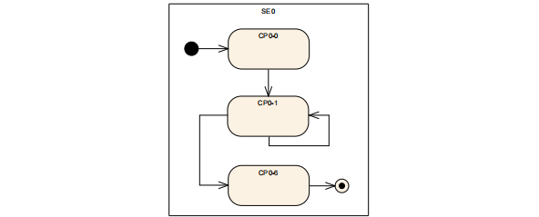
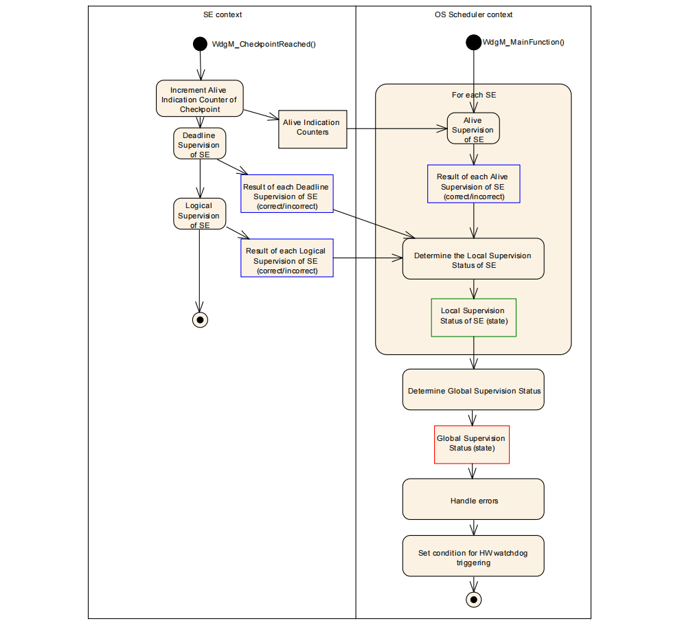

> 本文章所参考的 AUTOSAR 标准为 4.4.0 版本

# 简介

`Watchdog Manager` 在 `AUTOSAR` 架构中扮演着应用层软狗机制的角色，负责监控被称为“监控实体”的对象。其监控方式涵盖以下三种：

- `Alive Supervision`：专门监控周期性任务是否按预期周期性运行，确保任务没有遗漏或延迟执行。
- `Deadline Supervision`：关注事件型任务的执行时间，确保任务在规定的时间内完成，防止任务超时导致的系统不稳定。
- `Logical Supervision`：用于监控任务的执行时序，保证任务之间的依赖关系和执行顺序正确无误。

为了实施这些监控机制，每个监控实体都会设置相应的 `Checkpoint`。一个监控实体可以有一个或多个 `Checkpoint`，这些 `Checkpoint` 及其转换关系在单个实体内部被称为内图，而涉及不同监控实体的 `Checkpoint` 及其关系则构成外图。

具体应用中，一个监控实体可能会采用上述三种监控机制中的一种、多种或全部，这完全取决于实际应用场景和需求。基于这些监控机制的结果，每个监控实体都会计算出一个被称为 `Local Status` 的本地状态。

最终，当所有监控实体的状态被确定后，`Watchdog Manager` 可以综合这些信息，得出整个 `MCU` 的监控结果，即 `Global Status`。这一全局状态为系统提供了关于其整体运行状况的全面视图，有助于及时发现并处理问题，确保系统的稳定运行。

# 工作原理

- `S1`：`Watchdog Manager` 模块通过与 `Watchdog Interface（Watchdog If）`和 `Watchdog Driver` 的交互来设置看门狗喂狗的触发条件。这一触发条件通常由 `Watchdog Manager` 的函数接口来重置 `Watchdog Driver` 中的 `Counter` 值。

- `S2`：在系统运行过程中，`Watchdog Driver` 会持续监控 `Counter` 的值。若 `Counter` 不为 0，表示系统仍在正常运行范围内，`Watchdog Driver` 会进行一次喂狗操作，并将 `Counter` 值减一。

- `S3`：如果 `Counter` 值没有被 `Watchdog Manager` 及时重置，它将逐渐减少至 0。一旦 `Counter` 值到达 0，`Watchdog Driver` 将停止喂狗，此时看门狗会触发系统复位操作，以恢复系统的正常运行。如果系统恢复正常，流程将回到 `S2` 继续执行。

在特殊情况下，如果触发条件不满足，导致无法正常喂狗，存在两种复位方式可供选择：

- 等待看门狗超时复位：在这种情况下，`Watchdog Driver` 会停止喂狗，并等待看门狗超时后自动触发系统复位。
- 主动立即触发系统复位：当 `Watchdog Manager` 检测到严重错误时，它可以主动触发系统立即复位，以避免潜在的系统崩溃或数据损坏。

这两种复位方式可以根据实际需求和应用场景选择使用。需要注意的是，`Watchdog Driver` 的初始化过程不应由 `Watchdog Manager` 负责，而应由 `EcuM（Electronic Control Unit Manager）`模块来完成。同时，`Watchdog Manager` 的初始化应在操作系统（`OS`）启动之后执行，以确保其正常工作并监控系统的运行状态。

# Alive Supervision

针对周期性任务，监控实体在预设时间内的执行次数是固定的。通过这一机制，我们能够精准检测周期性任务的执行频率是否异常，确保系统稳定运行。

AUTOSAR 中 `Alive Supervision` 监控机制需要配置以下四个基本参数：

- `WdgMExpectedAliveIndications` (期望指示次数): 指定在给定的时间周期内，监控实体(SE)应调用 `WdgM_CheckpointReached` 函数的次数。这是预期的正常调用次数。

- `WdgMMaxMargin` (最大允许偏差): 表示实际调用 `WdgM_CheckpointReached` 函数次数可以超过期望次数的最大值。实际允许的最大调用次数为 `WdgMExpectedAliveIndications + WdgMMaxMargin`。

- `WdgMMinMargin` (最小允许偏差): 表示实际调用 `WdgM_CheckpointReached` 函数次数可以低于期望次数的最大值。实际允许的最小调用次数为 `WdgMExpectedAliveIndications - WdgMMinMargin`。

- `WdgMSupervisionReferenceCycle` (监控参考周期): 定义了 `WdgM_Mainfunction` 函数的调用周期，即监控的时间基准。

以配置`{4, 1, 1, 2}`为例，这表示 `WdgM_Mainfunction` 函数两次。在这两次内，对应的 `WdgM_CheckpointReached` 函数的调用次数应在`(4 - 1) = 3` 次到`(4 + 1) = 5` 次之间。若超出此范围，则视为超时，并根据 `AUTOSAR` 状态机规范更新该监控实体(`SE`)的 `Local Status`，以反映其不符合预期的运行状态。

# Deadline Supervision

如前文所述，`Deadline supervison` 主要用于非周期性的监控实体 `SE`，该类监控实体往往都是事件型进行触发，触发之后的监控实体 `SE` 执行的时间不能过长，同时也不能过短，这个 `SE` 的执行时长就需要通过相应的阈值进行限定，从而来监控其运行状态是否满足设计要求。

对于每一个 `SE` 的 `Deadline Supervision`，两个 `Checkpoint` 时必须需要进行配置的，因为 `Deadline Supervision` 就是针对两个 `Checkpoint` 之间的 `Transition` 执行时间进行监控，即针对监控实体 `SE` 执行的动态行为进行监控。

AUTOSAR 中 `Deadline Supervision` 监控机制需要配置以下两个基本参数：

- `WdgMDeadlineMin`：这是两个 `Checkpoint` 之间 `Transition` 所允许的最小执行时间。它确保 `SE` 不会执行得过快，从而可能忽略关键任务或跳过必要的步骤。

- `WdgMDeadlineMax`：这是两个 `Checkpoint` 之间 `Transition` 所允许的最大执行时间。它防止 `SE` 执行时间过长，从而可能导致系统延迟或其他性能问题。

重要的是，此类监控的 `SE` 中不允许存在 `Checkpoint` 的嵌套行为。例如，`Start1`, `Start2`, `End2`, `End1` 这样的顺序是不被允许的，因为这可能导致时间监控的混乱和不可预测的行为。

以配置`{30ms, 40ms}`为例，这表示对应的 `SE` 在两个 `Checkpoint` 之间的 `Transition` 执行时间必须在 `30` 毫秒到 `40` 毫秒之间。如果实际执行时间超出这个范围，则视为超时，系统会根据 `AUTOSAR` 状态机规范更新该监控实体(`SE`) 的 `Local Status`，以反映其不符合预期的运行状态。

# Logic Supervision

> 在 ISO 26262 中，程序流监控是确保行车安全的关键环节。它能够有效识别软件运行中的设计意图偏离，并采取相应的纠正措施，从而保障车辆系统的稳定运行。

`Logic Supervision` 在 `AUTOSAR` 中扮演着确保程序流运行时序正确性的关键角色，这对于满足功能安全要求的电子控制单元（`ECU`）来说至关重要。它通过比对实际运行过程中 `Checkpoint` 之间的转换关系与预先设定的 `Checkpoint` 转换关系来进行判断。如果实际转换关系与设定不符，系统会报告错误；若实际转换关系符合预设要求，则程序运行正常。
通过 `Logic Supervision`，可以及时发现并处理程序流中的时序错误，从而确保 `ECU` 在复杂多变的车辆运行环境中能够稳定、可靠地执行其功能。这种监控机制有助于提高车辆的整体安全性和可靠性，是功能安全标准中不可或缺的一部分。

如上图我们可以知道我们将每个代码执行步骤分成了上面 7 个 `Checkpoint`，其简化模型如下图所示：

也可以抽象成以下形式：

在 `Logic Supervision` 中，识别两两 `Checkpoint` 之间的转换关系是否属于静态配置的转换关系 `Group` 是关键步骤。这些静态配置的转换关系 `Group` 定义了哪些 `Checkpoint` 之间的转换是合法和预期的。

当程序执行时，`Logic Supervision` 会监控当前 `Checkpoint` 与下一个 `Checkpoint` 之间的转换关系。如果这个转换关系包含在静态配置的转换关系 `Group` 中，那么认为程序执行的是正常的序列行为。如果转换关系不在配置的 `Group` 内，则表明发生了异常，可能是程序逻辑错误或其他问题导致的。

为了确保程序流的正确性，开发人员需要仔细定义和配置这些转换关系 `Group`。这些 `Group` 应该基于程序逻辑和功能需求来设计，以确保它们能够准确反映程序执行过程中的合法切换路径。

# 工作流程

`Watchdog Manager` 模块的运行流程如下：

基于上图的 `Watchdog Manager` 模块运行流程，我们可以得出以下重要结论：

- 对于采用 `Alive Supervision` 的监控实体，其运行状态和生命周期的判断结果，在 `WdgM_Mainfunction` 函数中得出。
- 对于采用 `Deadline Supervision` 或 `Logical Supervision` 的监控实体，其判断结果则在 `WdgM_CheckpointReached` 函数中得出。

# API

| 函数名                       | 函数功能                                                                                                      |
| ---------------------------- | ------------------------------------------------------------------------------------------------------------- |
| **WdgM_Init**                | 初始化 `WdgM` 模块                                                                                            |
| **WdgM_DeInit**              | 反初始化 `WdgM` 模块，在执行本函数之前，因设置看门狗最大超时时间，确保其能正常进入 `WDGIF_OFF_MODE`，或者复位 |
| **WdgM_GetVersionInfo**      | 返回 `WdgM` 模块的版本信息                                                                                    |
| **WdgM_SetMode**             | 设置提前预设好的工作模式                                                                                      |
| **WdgM_GetMode**             | 获取当前的工作模式                                                                                            |
| **WdgM_CheckpointReached**   | 通知 `WdgM` 已经到达了 `SE` 的 `Checkpoint`                                                                   |
| **WdgM_GetLocalStatus**      | 获取一个 `SE` 的 `Local Status`                                                                               |
| **WdgM_GetGlobalStatus**     | 获取 `Global Status`                                                                                          |
| **WdgM_PerformReset**        | 主动触发复位                                                                                                  |
| **WdgM_GetFirstExpiredSEID** | 获取第一个超时的 `SE` 的 `ID`                                                                                 |
| **WdgM_MainFunction**        | `WdgM` 循环处理的周期执行函数                                                                                 |

# 软件实现

待更新

# 参考

- https://www.zhihu.com/tardis/zm/art/651467544?source_id=1005
