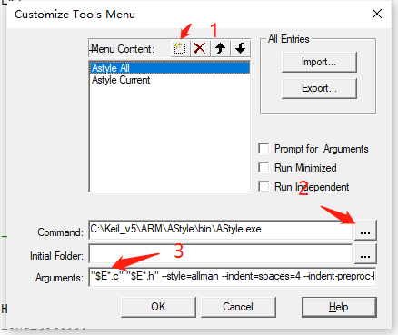

## Keil-Jlink闪退

### 原因

Jlink版本和Keil的版本都过高，且由于Jlink为盗版，导致闪退。

具体为**JLinkARM.dll**这个插件搞鬼。


这个插件的来源为


也就是我们装Jlink驱动的时候，勾选了这个选项，而导致这个毒瘤插件进入Keil，以后安装插件的时候取消安装就可以了。

### 解决措施

1. 找到”Keil安装目录“\ARM\Segger

   

2. 下载老版Keil的驱动：https://xqyjlj.lanzoui.com/b0axo4dte ；密码:g1h7

3. 将里面的驱动解压替换现在的驱动，重启Keil就可以解决了。

##  Cannot load driver ‘C:\Keil_v5\ARM\Segger\JL2CM3.dll 


### 原因

Jlink版本和Keil的版本都过高，且由于Jlink为盗版，导致闪退。

具体为**JLinkARM.dll**这个插件搞鬼。


这个插件的来源为


也就是我们装Jlink驱动的时候，勾选了这个选项，而导致这个毒瘤插件进入Keil，以后安装插件的时候取消安装就可以了。

### 解决措施

1. 找到”Keil安装目录“\ARM\Segger

   

2. 下载老版Keil的驱动：https://xqyjlj.lanzoui.com/b0axo4dte ；密码:g1h7

3. 将里面的驱动解压替换现在的驱动，重启Keil就可以解决了。

## Keil 使用 Astyle 自动格式化

### 关于Astyle

Astyle 的全称是Artistic Style的简称，是一个开源的源代码格式化工具，可以对C，C++，C#以及Java等编程语言的源代码进行缩进、格式化、美化。

**Home Page**: http://astyle.sourceforge.net/
**Project Page**: http://sourceforge.net/projects/astyle/

### Astyle下载

https://sourceforge.net/projects/astyle/

https://xqyjlj.lanzoui.com/b0axo50yh 密码:69tj

下载之后解压，推荐解压到Keil的安装目录，避免误删除。


### 创建菜单按钮


1. 创建应用 **Astyle All**

2. 选择**Astyle**路径

3. 添加参数

   ```shell
   "$E*.c" "$E*.h" --style=allman --indent=spaces=4 --indent-preproc-block --pad-header --pad-oper --unpad-paren --suffix=none --lineend=linux --convert-tabs --align-pointer=type --verbose
   ```

   其中
   
   ```shell
   "$E*.c" "$E*.h" 	##当前目录下所有的.c .h文件
   ```
   
   ```shell
   --style=allman 
   --indent=spaces=4 
   --indent-preproc-block 
   --pad-header 
   --pad-oper 
   --unpad-paren 
   --suffix=none 
   --lineend=linux 
   --convert-tabs 
   --align-pointer=type 
   --verbose
   ```
   
   此为Astyle命令，具体含义请移步 http://astyle.sourceforge.net/astyle.html

   

4. 按下OK后，tool下就有以下按钮

   

5. 按下按钮之后，启动自动格式化（需要先保存文件）。

   

   

6. 再增加一个应用**Astyle Current**

   ```shell
   !E --style=allman --indent=spaces=4 --indent-preproc-block --pad-header --pad-oper --unpad-paren --suffix=none --lineend=linux --convert-tabs --align-pointer=type --verbose
   ```

   其中

   ```shell
   !E    ##当前文件
   ```

   ```shell
   --style=allman 
   --indent=spaces=4 
   --indent-preproc-block 
   --pad-header 
   --pad-oper 
   --unpad-paren 
   --suffix=none 
   --lineend=linux 
   --convert-tabs 
   --align-pointer=type 
   --verbose
   ```

   

## Keil字体

   Keil默认字体本身不怎么好看。本人提供一些字体供大家下载。首选**JetBrains Mono**吧。**Consolas YaHei hybrid**要改设置，比较繁琐。

### JetBrains Mono

- 字体地址 ：https://www.jetbrains.com/lp/mono/

- 安装方式

  

- 字体预览

  

- 下载地址

  - https://download.jetbrains.com/fonts/JetBrainsMono-2.225.zip?_ga=2.243489413.18516330.1620736840-1147192159.1615307884
  - https://xqyjlj.lanzoui.com/b0axo56va 密码:38vm

### Consolas YaHei hybrid

- 安装方式

  - 打开Keil安装目录下的uv4文件夹，找到**global.prop**文件

    

  - 将font属性修改为**Consolas YaHei hybrid**
  
    
  
- 字体预览

  

- 下载地址： https://xqyjlj.lanzoui.com/b0axo56va 密码:38vm

## Keil设置

- 编码：首选**UTF-8** （较高版本才会有）

  

- Tab大小：4

  

- 自动补全

  