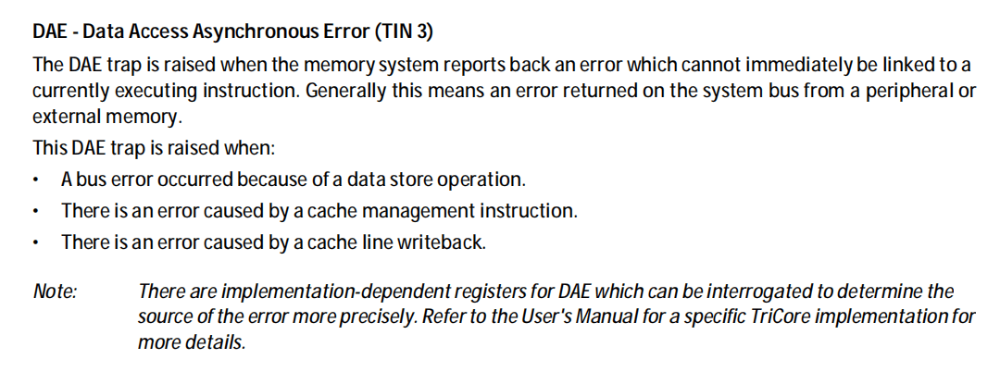
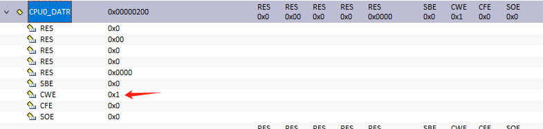
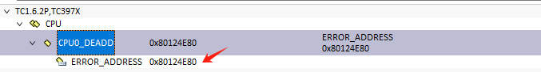

# 问题描述

在一个基于 `TC397(TriCore)`板子的代码功能合并中，观察到以下现象：单独运行 `a` 功能或 `b` 功能时，系统均表现正常，无异常发生。然而，当尝试将这两个功能合并运行时，系统出现异常，触发 `Class4,Tin3` 陷阱。尽管栈回溯还原的现场显示正常，但异常仍在访问一个正常的结构体变量后发生。让我们正在深入分析这一合并运行时的异常行为。

# 调试与步骤

首先，根据手册描述，`DAE` 陷阱通常发生在内存系统报告的错误无法立即与当前执行的指令相关联时，这通常涉及外设或外部存储器返回的错误。触发 `DAE` 陷阱的情况包括数据存储操作导致的总线错误、高速缓存管理指令错误以及高速缓存行回写错误。

为了更精确地确定错误源，我们需要参考 `AURIX TC3xx` 的用户手册，其中提到了 `DATR` 寄存器。这个寄存器作为 `DAE` 陷阱的状态标志寄存器，为我们提供了关于 `DAE` 陷阱原因的信息。因此，在分析 `a` 和 `b` 功能合并运行时触发的 `Class4,Tin3` 陷阱时，我们需要重点检查 `DATR` 寄存器的状态，以进一步确定导致异常的具体原因。通过解读 `DATR` 寄存器的值，我们可以更好地理解这一异常行为，并据此制定相应的解决策略。

根据从 `DATR` 寄存器读取的数据可以得知，`CWE` 标志为 `1`，这表明本次 `DAE` 陷阱确实是由 `Cache` 回写操作引起的。既然问题涉及 `Cache`，那么下一步的关键是定位具体的异常地址。

`DEADD` 寄存器用于存储 `MEM`、`ALN`、`DSE` 或 `DAE` 陷阱触发时的异常地址信息。通过读取 `DEADD` 寄存器的值，我们可以获得导致陷阱的具体内存地址。这一地址对于分析错误原因至关重要，因为它可以帮助我们确定是哪个内存位置在 `Cache` 回写时发生了问题。

拿到异常内存地址后，通过查询 `map` 文件，发现该地址指向一个 `const` 修饰的全局结构体变量。这确实是一个重要的线索，因为它暗示程序可能尝试修改了 `const` 类型的变量，进而在 `cache` 回写时引发了异常。

鉴于回写时修改现场已不可见，我们设置 `DCON0` 寄存器的 `DCBYP` 位为 1，关闭 `Cache` 以准确定位问题所在。

在无 `Cache` 的陷阱中，我们利用栈回溯迅速定位到修改 `const` 内存的代码。写代码的作者通过类型强制转换移除了 `const` 修饰符，进而对变量进行修改。在其测试用例中，由于数据量较小，`Cache` 尚未填满，因此未触发回写操作，从而产生了正常运行的假象。具体情形如下图所示：


autoactivate on
main -> "func a" : job a
return return
note right: 这里修改了 const 变量，但是还未触发 cache 回写
main -> "func b" : job b
return return
destroy "func b"
note right: 这里又读了一个大变量，cache 没命中，在缓存中分配一个缓存块，\n 造成 cache 回写，将"func a"错误的数据写回，最终在这里抛出异常，\n 造成 Trap，在这里的栈回溯并拿不到任何有用的信息


# 结论

在 `TriCore` 架构中，`const` 数据通常存储在 `rodata` 段中，该段数据直接位于 `flash` 存储器中。当 `CPU` 通过 `cache` 读取 `rodata` 段数据时，如果非法修改了 `cache` 中的对应数据，虽然不会立即报错，但在后续的 `cache` 回写操作中，会触发 `DAE` 陷阱。这是因为 `cache` 与 `flash` 之间的数据一致性在回写时被破坏，导致硬件异常。因此，在编程时，必须严格遵守 `const` 变量的使用规则，避免对其进行非法修改。
