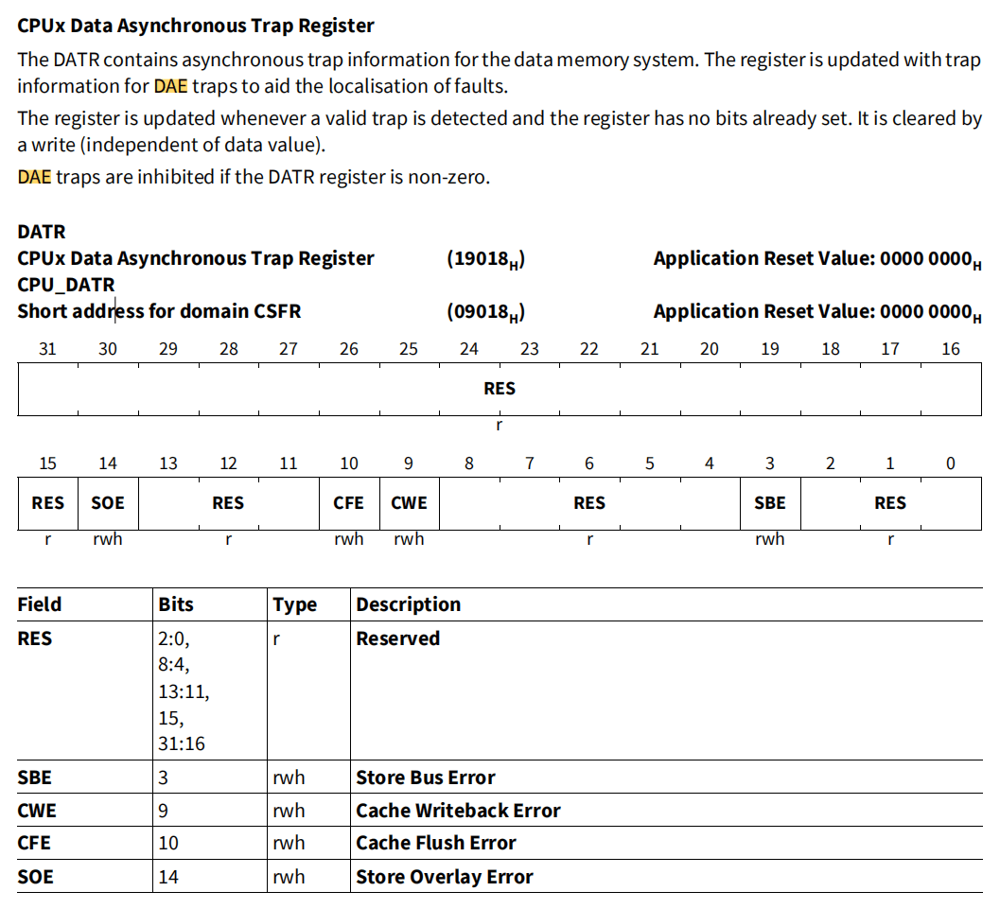
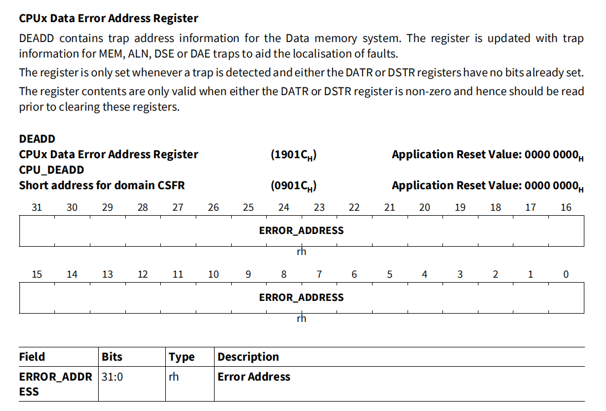
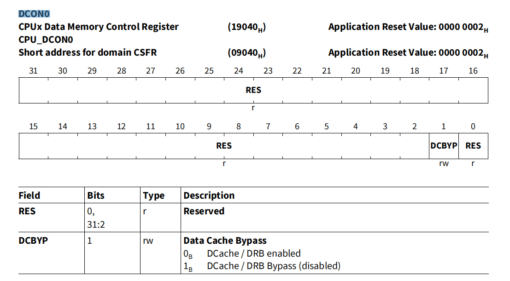

# 问题描述

最近在 `TC397(TriCore)`的板子上遇到了这么一个问题，`a` 功能单独跑没问题，`b` 功能单独跑也没问题，但是这两个功能一合并在一起就出现异常，进入 `Class4,Tin3` 陷阱，栈回溯还原的现场正常，在访问了一个正常的结构体变量后触发`Class4,Tin3` 陷阱。

# 调试与步骤

首先我们看 `Trap` 的类型，以下是相关的手册翻译

```txt
当内存系统报告的错误无法立即与当前执行的指令相关联时，DAE 陷阱就会触发。一般来说，这是指从外设或外部存储器返回系统总线的错误。

当出现以下情况时，会触发 DAE 陷阱

- 数据存储操作导致总线错误。

- 高速缓存管理指令导致错误。

- 高速缓存行回写导致错误。

注意：DAE 的实现依赖于寄存器，可以通过查询寄存器更精确地确定错误源。有关详细信息，请参阅特定 TriCore 实现的《用户手册》。
```

再参照 `AURIX TC3xx` 的用户手册，我们就可以找到 `DATR` 这个寄存器，

大致意思为，`DATR` 是 `DAE` 陷阱的状态标志寄存器，指示着 `DAE` 陷阱的原因



读出来的数据显示 `CWE` 为 1，也就代表着本次陷阱是由于 `Cache` 回写造成

既然是 `Cache` 问题，那么我们可以使用 `DEADD` 寄存器读取当时异常时的地址，`DEADD` 储存着 `MEM`、`ALN`、`DSE` 或 `DAE` 陷阱触发时的异常地址信息



拿到异常内存地址之后，在 map 文件一查，显示该内存指向一个 `const` 的全局结构体变量，这时候其实就已经意识到是程序修改了 `const` 类型的变量，在 `cache` 回写的时候触发的异常。由于 `cache` 回写的时候，现场已经不是修改 `const` 变量的现场了，这时候我们将 `DCON0` 寄存器的 `DCBYP` 位写 `1` 后，把 `cache` 关闭去定位。



# 结果

由此，在无 `cache` 的 `trap` 中，直接通过栈回溯便找到了修改 `const` 内存的代码，写代码的作者直接通过类型强转去除 `const` 修饰符来对变量进行修改，在其测试用例中，由于数据量较小，`cache` 还没满，未造成回写，也就导致了正常运行的假象。
