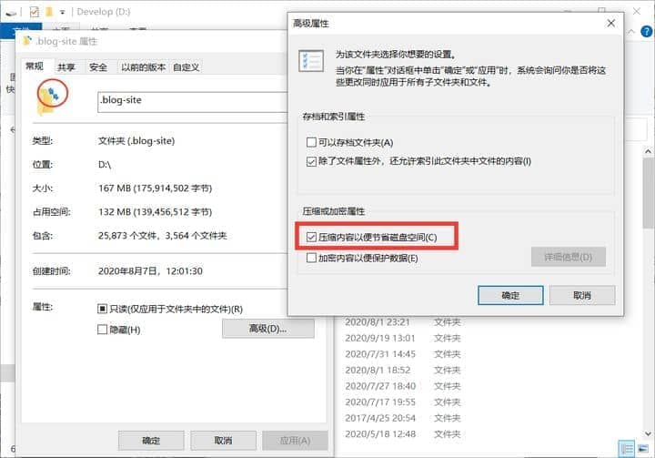

1. 点此下载离线 wsl 包 https://learn.microsoft.com/zh-cn/windows/wsl/install-manual

2. 将下载的文件加上 .zip 后缀，对齐进行解压。

   

3. 把它的后缀改为`.zip`，然后解压到想要安装WSL的目录下。

4. 点击 ubuntu.exe，等待一段时间就成功安装到当前目录。

5. 需要注意的是安装目录的磁盘不能开**压缩内容以便节省磁盘空间**选项，否则会报错 0xc03a001a, 可以右键【文件夹-->属性-->常规-->高级】找到并关闭这个选项。

   

6. 要卸载的话使用命令 wsl --unregister <要卸载的发行版>，之后删除文件夹即可。
7. 可以使用 wsl --list --verbose 查看安装的 wsl
8. 使用 wsl --shutdown 关闭所有的 wsl
9. wsl -t Ubuntu-20.04 关闭指定的 wsl
