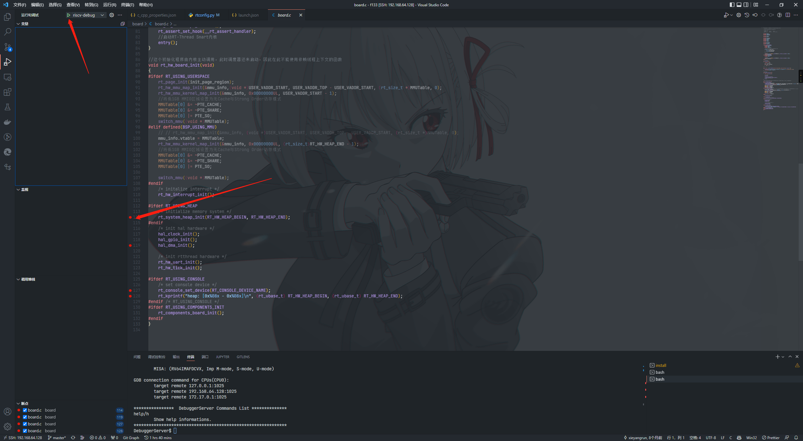

## 前言

最近从一个老司机那里搞来一块[Lichee D1 Dock Pro](https://occ.t-head.cn/vendor/detail/index?id=4030046623349878784)开发板，由于其板载 jtag 功能，加上现在深圳动不动就封个几天，因此，想尝试一下远程对RISC-V CPU Debug 的可行性。

废话不多说，直接上干货！

## DebugServer安装

```shell
curl -s https://occ-oss-prod.oss-cn-hangzhou.aliyuncs.com/resource//1657868508115/T-Head-DebugServer-linux-x86_64-V5.16.2-20220708.sh.tar.gz | tar xzf -
sudo chmod 777 ./T-Head-DebugServer-linux-x86_64-V5.16.2-20220708.sh -R
sudo ./T-Head-DebugServer-linux-x86_64-V5.16.2-20220708.sh -i
DebugServerConsole -setclk 8 -port 1025
```

如果出现以下日志，则说明已经安装成功了

```shell
+---                                                    ---+
|  T-Head Debugger Server (Build: Jul  8 2022)             |
   User   Layer Version : 5.16.02
   Target Layer version : 2.0
|  Copyright (C) 2022 T-HEAD Semiconductor Co.,Ltd.        |
+---                                                    ---+
T-HEAD: CKLink_Lite_V2, App_ver unknown, Bit_ver null, Clock 2526.316KHz,
       5-wire, With DDC, Cache Flush On, SN CKLink_Lite_Vendor-rog 199C8A.
+--  Debug Arch is CKHAD.  --+
+--  CPU 0  --+
T-HEAD Xuan Tie CPU Info:
        WORD[0]: 0x0910090d
        WORD[1]: 0x11002000
        WORD[2]: 0x260c0001
        WORD[3]: 0x30030066
        WORD[4]: 0x42180000
        WORD[5]: 0x50000000
        WORD[6]: 0x60000853
        MISA   : 0x8000000000b4112d
Target Chip Info:
        CPU Type is C906FDV, Endian=Little, Vlen=128, Version is R1S0P2.
        DCache size is 32K, 4-Way Set Associative, Line Size is 64Bytes, with no ECC.
        ICache size is 32K, 2-Way Set Associative, Line Size is 64Bytes, with no ECC.
        Target is 1 core.
        MMU has 256 JTLB items.
        PMP zone num is 8.
        HWBKPT number is 2, HWWP number is 2.
        MISA: (RV64IMAFDCVX, Imp M-mode, S-mode, U-mode)

GDB connection command for CPUs(CPU0):
        target remote 127.0.0.1:1025
        target remote 192.168.64.128:1025
        target remote 172.17.0.1:1025

****************  DebuggerServer Commands List **************
help/h
        Show help informations.
*************************************************************
```

如果出现以下日志，插拔几次，复位板子多试试。

```shell
+---                                                    ---+
|  T-Head Debugger Server (Build: Jul  8 2022)             |
   User   Layer Version : 5.16.02 
   Target Layer version : 2.0
|  Copyright (C) 2022 T-HEAD Semiconductor Co.,Ltd.        |
+---                                                    ---+
ERROR: Fail to write to CKLINK.
ERROR: Fail to write to CKLINK.
ERROR: Fail to write to CKLINK.
```

## 工具链安装

我这里直接用柿饼 M7 的开发环境，柿饼 M7 的开发环境可以参考[Persim-M7 Ubuntu环境搭建(Docker)](https://xqyjlj.github.io/2022/09/11/Persim-M7%20Ubuntu%E7%8E%AF%E5%A2%83%E6%90%AD%E5%BB%BA(Docker))：

执行以下命令，看看 gdb 是否能够正常运行

```shell
/opt/Xuantie-900-gcc-elf-newlib-x86_64-V2.2.6/bin/riscv64-unknown-elf-gdb -v
```

我的环境是 ubuntu 20.04，他报了依赖错误，其他平台需要自己解决错误：

```shell
/opt/Xuantie-900-gcc-elf-newlib-x86_64-V2.2.6/bin/riscv64-unknown-elf-gdb: error while loading shared libraries: libncursesw.so.5: cannot open shared object file: No such file or directory
```

创建个链接就解决了

```shell
sudo ln -s /lib/x86_64-linux-gnu/libncursesw.so.6 /lib/x86_64-linux-gnu/libncursesw.so.5
```

## VSCode远程开发

通过VSCode远程到ubuntu中这里可以参考[Window SSH 远程开发环境搭建](https://xqyjlj.github.io/2022/09/11/Window%20SSH%20%E8%BF%9C%E7%A8%8B%E5%BC%80%E5%8F%91%E7%8E%AF%E5%A2%83%E6%90%AD%E5%BB%BA/)，将设为debug模式


按下快捷键【 **Ctrl+Shift+`** 】新建一个终端，执行命令【 **get_persim_m7** 】获取 m7 的开发环境变量


随后执行【 scons --target=vsc 】，创建 VSCode 配置文件


创建 launch.json 文件

```json
{
    "version": "0.2.0",
    "configurations": [
        {
            "name": "riscv-debug",
            "type": "cppdbg",
            "request": "launch",
            "miDebuggerPath": "/opt/Xuantie-900-gcc-elf-newlib-x86_64-V2.2.6/bin/riscv64-unknown-elf-gdb",
            "program": "${workspaceRoot}/rtthread.elf",
            "setupCommands": [
                {
                    "description": "为 gdb 启用整齐打印",
                    "text": "-enable-pretty-printing",
                    "ignoreFailures": true
                },
                {
                    "text": "target remote localhost:1025"
                },
                {
                    "text": "restore ${workspaceFolder}/rtthread.elf"
                },
                {
                    "text": "set $pc=0x41000000"
                },
            ],
            "launchCompleteCommand": "None",
            "cwd": "${workspaceFolder}"
        }
    ]
}
```

其中启动方式为附着方式，即芯片原有程序依然在 Flash 运行，并开启了 JTAG 与 初始化了 DDR，加载 elf 文件后手动调整 PC 指针至 0x41000000 启动


## 开始调试

在终端中执行命令【 DebugServerConsole -setclk 8 -port 1025 】启动 DebugServer


点击随便下几个断点，并进入调试模式观察



可以看到，已经可以正常调试了（全部都是远程哦）


## 裸机调试

裸机开发需要开启 jtag，并初始化 ddr，

我们可以借助 xfel 工具执行以下命令

```shell
xfel version
xfel jtag
xfel ddr
```

此后再进行调试即可。
